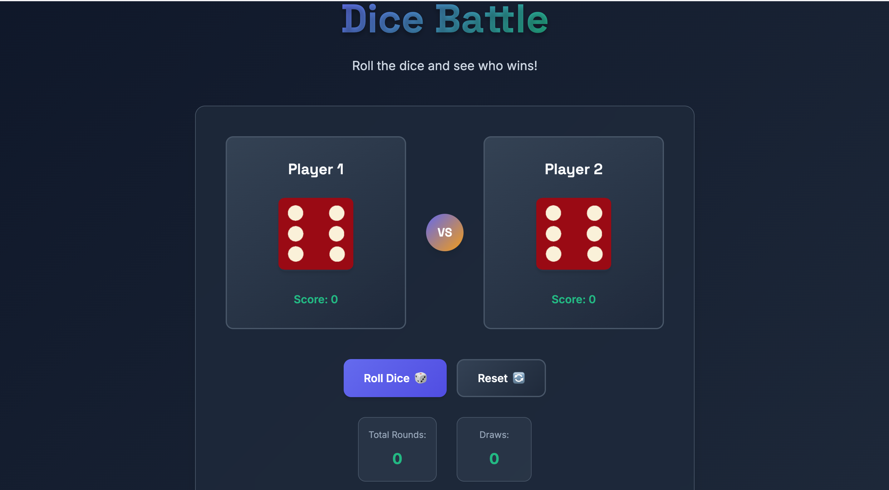

# 🎲 Modern Dice Battle Game

A beautifully designed, interactive dice game built with modern web technologies. Challenge your friends or play solo in this engaging two-player dice battle!

   

## 🖼️ Demo


_Experience the beautiful modern interface with smooth animations and responsive design_

## ✨ Features

### 🎮 Core Gameplay

- **Interactive Dice Rolling**: Click the roll button or press spacebar to roll
- **Real-time Scoring**: Track wins for both players
- **Animated Dice**: Smooth rolling animations with visual feedback
- **Winner Detection**: Automatic winner determination with celebration effects

### 🎨 Modern Design

- **Responsive Layout**: Works perfectly on desktop, tablet, and mobile
- **Dark Theme**: Eye-friendly dark mode with gradient backgrounds
- **Smooth Animations**: CSS animations and transitions for better UX
- **Modern Typography**: Clean, readable fonts with proper hierarchy
- **Glass Morphism**: Modern UI with backdrop blur effects

### 🚀 Enhanced Features

- **Score Tracking**: Keep track of total wins for each player
- **Game Statistics**: View total rounds played and draws
- **Keyboard Support**: Spacebar to roll, Ctrl+R to reset
- **Touch Support**: Mobile-friendly touch interactions
- **Sound Effects**: Audio feedback for game actions
- **Accessibility**: ARIA labels and keyboard navigation

### 🎯 User Experience

- **Loading States**: Visual feedback during dice rolling
- **Error Handling**: Graceful error handling and recovery
- **Easter Eggs**: Hidden features for extra fun
- **Smooth Transitions**: Fluid animations between game states

## 🎮 How to Play

1. **Start the Game**: Open `dice.html` in your web browser
2. **Roll the Dice**: Click the "Roll Dice" button or press the spacebar
3. **Watch the Animation**: Enjoy the smooth dice rolling animation
4. **See the Result**: The game automatically determines the winner
5. **Track Scores**: Monitor your wins in the score display
6. **Reset Anytime**: Click "Reset" to start a new game

## 🛠️ Technical Features

### Modern JavaScript (ES6+)

- **Class-based Architecture**: Clean, maintainable code structure
- **Async/Await**: Modern asynchronous programming
- **Event Handling**: Comprehensive event management
- **Error Handling**: Robust error handling and recovery

### Advanced CSS

- **CSS Custom Properties**: Consistent theming with CSS variables
- **Flexbox & Grid**: Modern layout techniques
- **CSS Animations**: Smooth, performant animations
- **Media Queries**: Responsive design for all devices
- **Backdrop Filters**: Modern glass morphism effects

### Accessibility

- **Semantic HTML**: Proper HTML5 semantic elements
- **ARIA Labels**: Screen reader support
- **Keyboard Navigation**: Full keyboard accessibility
- **Focus Management**: Clear focus indicators

## 🚀 Getting Started

### Prerequisites

- A modern web browser (Chrome, Firefox, Safari, Edge)
- No additional dependencies required!

### Installation

1. Clone or download this repository
2. Open `dice.html` in your web browser
3. Start playing immediately!

### File Structure

```
dice-game/
├── dice.html          # Main HTML file
├── dice.js            # Game logic and interactions
├── styles.css         # Modern CSS styling
├── images/            # Dice images
│   ├── dice1.png
│   ├── dice2.png
│   ├── dice3.png
│   ├── dice4.png
│   ├── dice5.png
│   └── dice6.png
└── README.md          # This file
```

## 🎨 Customization

### Colors

The game uses CSS custom properties for easy theming. Modify the `:root` variables in `styles.css`:

```css
:root {
  --primary-color: #6366f1; /* Main brand color */
  --accent-color: #10b981; /* Success/accent color */
  --background-dark: #0f172a; /* Dark background */
  /* ... more variables */
}
```

### Animations

Adjust animation durations and effects in the CSS:

```css
:root {
  --transition: all 0.3s cubic-bezier(0.4, 0, 0.2, 1);
}
```

## 🌟 Browser Support

- ✅ Chrome 60+
- ✅ Firefox 55+
- ✅ Safari 12+
- ✅ Edge 79+
- ✅ Mobile browsers (iOS Safari, Chrome Mobile)

## 🤝 Contributing

Contributions are welcome! Here are some ways you can help:

1. **Bug Reports**: Found a bug? Open an issue!
2. **Feature Requests**: Have an idea? Let us know!
3. **Code Contributions**: Submit a pull request!
4. **Documentation**: Help improve this README!

## 📝 License

This project is open source and available under the [MIT License](LICENSE).

## 🎉 Acknowledgments

- Original dice game concept
- Modern web design inspiration
- CSS animation techniques
- Accessibility best practices

## 🔮 Future Enhancements

- [ ] Multiplayer support
- [ ] Different dice types
- [ ] Tournament mode
- [ ] Sound customization
- [ ] Theme selection
- [ ] Save game state
- [ ] Leaderboards

---

**Made with ❤️ using modern web technologies**

_Enjoy the game and may the dice be ever in your favor!_ 🎲✨
